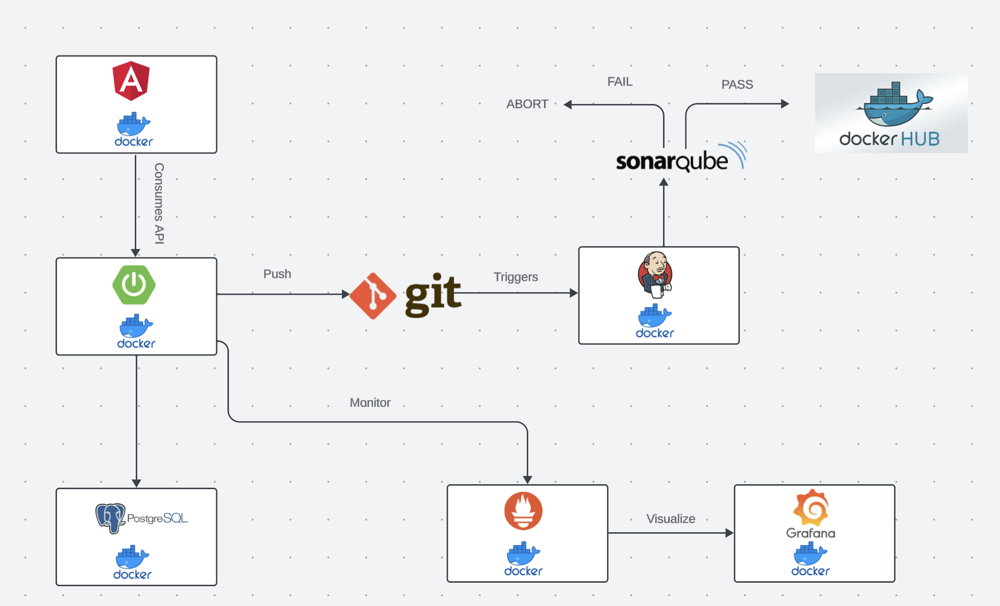
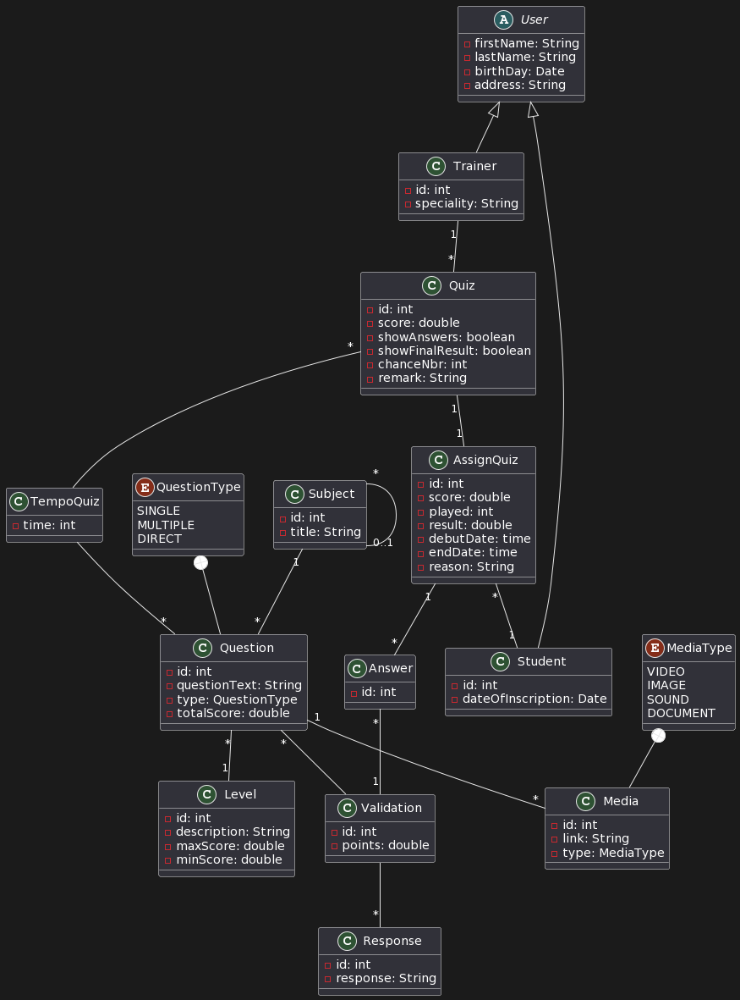

# YouQuiz

YouQuiz is an innovative e-learning platform designed to provide a comprehensive set of features catering to both instructors and students.

## Environment Variables

To run this project, you will need to define the following environments variable in the docker compose file.

`SPRING_DATASOURCE_URL`

`SPRING_DATASOURCE_USERNAME`

`SPRING_DATASOURCE_PASSWORD`

`POSTGRES_DB`

`POSTGRES_USER`

`POSTGRES_PASSWORD`

## Tech Stack

**Client:** Angular, TailwindCSS

**Server:** Springboot, Docker, Hibernate, Spring data JPA, Jenkins, Sonarqube, Prometheus, Grafana

**Unit Testing:** Junit 5, Mockito

## Application Architecture



## Class Diagram




## API Reference

#### Get all subjects

```http
  GET /api/subjects
```

| Parameter | Type     | Description                |
| :-------- | :------- | :------------------------- |
| `id` | `int` | id of subject |
| `title` | `string` | title of subject |
| `parent` | `Subject` | parent subject of that subject |
| `childs` | `Subject[]` | childs subject of that subject |

#### Get one subject

```http
  GET /api/subjects/${id}
```

| Parameter | Type     | Description                       |
| :-------- | :------- | :-------------------------------- |
| `id`      | `int` | **Required**. Id of subject to fetch |


#### Create subject

```http
  POST /api/subjects
```

| Parameter | Type     | Description                |
| :-------- | :------- | :------------------------- |
| `title` | `string` | **Required**. title of subject |
| `parent` | `Subject` | parent subject of that subject |

#### Update subject

```http
  PUT /api/subjects/${id}
```

| Parameter | Type     | Description                |
| :-------- | :------- | :------------------------- |
| `id`      | `string` | **Required**. Id of subject to update |
| `title` | `string` | **Required**. title of subject |
| `parent` | `Subject` | parent subject of that subject |

#### Delete subject

```http
  DELETE /api/subjects/${id}
```

| Parameter | Type     | Description                       |
| :-------- | :------- | :-------------------------------- |
| `id`      | `int` | **Required**. Id of subject to delete |

#### Get all levels

```http
  GET /api/levels
```

| Parameter | Type     | Description                |
| :-------- | :------- | :------------------------- |
| `id` | `int` | id of level |
| `description` | `string` | description of level |
| `maxScore` | `double` | max score of level |
| `minScore` | `double` | min score of level |

#### Get one level

```http
  GET /api/levels/${id}
```

| Parameter | Type     | Description                |
| :-------- | :------- | :------------------------- |
| `id`      | `int` | **Required**. Id of level to fetch |

#### Create level

```http
  POST /api/levels
```

| Parameter | Type     | Description                |
| :-------- | :------- | :------------------------- |
| `description` | `string` | **Required**. description of level |
| `maxScore` | `double` | **Required**. max score of level |
| `minScore` | `double` | **Required**. min score of level |

#### Update level

```http
  PUT /api/levels/${id}
```

| Parameter | Type     | Description                |
| :-------- | :------- | :------------------------- |
| `id`      | `int` | **Required**. Id of level to update |
| `description` | `string` | **Required**. description of level |
| `maxScore` | `double` | **Required**. max score of level |
| `minScore` | `double` | **Required**. min score of level |

#### Delete level

```http
  DELETE /api/levels/${id}
```

| Parameter | Type     | Description                |
| :-------- | :------- | :------------------------- |
| `id`      | `int` | **Required**. Id of level to delete |

#### Get all medias

```http
  GET /api/medias
```

| Parameter | Type     | Description                |
| :-------- | :------- | :------------------------- |
| `id` | `int` | id of media |
| `link` | `string` | link of media |
| `type` | `string` | media type of media |
| `question` | `Question` | question associeted with that media |

#### Get one media

```http
  GET /api/medias/${id}
```

| Parameter | Type     | Description                |
| :-------- | :------- | :------------------------- |
| `id`      | `int` | **Required**. Id of media to fetch

#### Delete media

```http
  DELETE /api/medias/${id}
```

| Parameter | Type     | Description                |
| :-------- | :------- | :------------------------- |
| `id`      | `int` | **Required**. Id of media to delete

#### Create media

```http
  POST /api/medias
```

| Parameter | Type     | Description                |
| :-------- | :------- | :------------------------- |
| `link` | `string` | **Required**. link of media |
| `type` | `string` | **Required**. media type of media |
| `question_id` | `int` | **Required**. question id associeted with that media |

#### Update media

```http
  PUT /api/medias/${id}
```

| Parameter | Type     | Description                |
| :-------- | :------- | :------------------------- |
| `id`      | `int` | **Required**. Id of media to update
| `link` | `string` | l**Required**. link of media |
| `type` | `string` | **Required**. media type of media |
| `question_id` | `int` | **Required**. question id associeted with that media |

#### Get all questions

```http
  GET /api/questions
```

| Parameter | Type     | Description                |
| :-------- | :------- | :------------------------- |
| `id` | `int` | id of question |
| `questionText` | `string` | the content of that question |
| `questionType` | `string` | type of question |
| `totalScore` | `double` | total score of question |
| `subject` | `Subject` | subject of that question |
| `level` | `int` | level of that question |
| `medias` | `Media[]` | medias of that question |

#### Get one question

```http
  GET /api/questions/${id}
```

| Parameter | Type     | Description                |
| :-------- | :------- | :------------------------- |
| `id`      | `int` | **Required**. Id of question to fetch |

#### Delete question

```http
  DELETE /api/questions/${id}
```

| Parameter | Type     | Description                |
| :-------- | :------- | :------------------------- |
| `id`      | `int` | **Required**. Id of question to delete |

#### Create question

```http
  POST /api/questions
```

| Parameter | Type     | Description                |
| :-------- | :------- | :------------------------- |
| `questionText` | `string` | **Required**. the content of that question |
| `questionType` | `string` | **Required**. type of question |
| `totalScore` | `double` | **Required**. total score of question |
| `subject_id` | `int` | **Required**. id of the subject of that question |
| `level_id` | `int` | **Required**. id of the level of that question |

#### Update question

```http
  PUT /api/questions/${id}
```

| Parameter | Type     | Description                |
| :-------- | :------- | :------------------------- |
| `id`      | `int` | **Required**. Id of question to update |
| `questionText` | `string` | **Required**. the content of that question |
| `questionType` | `string` | **Required**. type of question |
| `totalScore` | `double` | **Required**. total score of question |
| `subject_id` | `int` | **Required**. id of the subject of that question |
| `level_id` | `int` | **Required**. id of the level of that question |

#### Get questions by level

```http
  GET /api/questions/level/${id}
```

| Parameter | Type     | Description                |
| :-------- | :------- | :------------------------- |
| `id`      | `int` | **Required**. Id of level used to fetch questions |

#### Get questions by subject

```http
  GET /api/questions/subject/${id}
```

| Parameter | Type     | Description                |
| :-------- | :------- | :------------------------- |
| `id`      | `int` | **Required**. Id of subject used to fetch questions |

#### Get responses by question

```http
  GET /api/questions/response/${id}
```

| Parameter | Type     | Description                |
| :-------- | :------- | :------------------------- |
| `id`      | `int` | **Required**. Id of question used to fetch responses |

#### Get all responses

```http
  GET /api/responses
```

| Parameter | Type     | Description                |
| :-------- | :------- | :------------------------- |
| `id` | `int` | id of response |
| `response` | `string` | the content of that response |

#### Get one response

```http
  GET /api/responses/${id}
```

| Parameter | Type     | Description                |
| :-------- | :------- | :------------------------- |
| `id`      | `int` | **Required**. Id of response used to fetch |

#### Delete response

```http
  DELETE /api/responses/${id}
```

| Parameter | Type     | Description                |
| :-------- | :------- | :------------------------- |
| `id`      | `int` | **Required**. Id of response to delete |

#### Create response

```http
  POST /api/responses
```

| Parameter | Type     | Description                |
| :-------- | :------- | :------------------------- |
| `response` | `string` | **Required**. the content of that response |

#### Update response

```http
  PUT /api/responses/${id}
```

| Parameter | Type     | Description                |
| :-------- | :------- | :------------------------- |
| `id`      | `int` | **Required**. Id of response to update |
| `response` | `string` | **Required**. the content of that response |

#### Get all validations

```http
  GET /api/validations
```

| Parameter | Type     | Description                |
| :-------- | :------- | :------------------------- |
| `id` | `int` | id of validation |
| `question` | `Question` | question |
| `response` | `Response` | response of that question |
| `points` | `double` | points of that response in this question |

#### Get one validation

```http
  GET /api/validations/${id}
```

| Parameter | Type     | Description                |
| :-------- | :------- | :------------------------- |
| `id`      | `int` | **Required**. Id of validation to fetch |

#### Delete validation

```http
  DELETE /api/validations/${id}
```

| Parameter | Type     | Description                |
| :-------- | :------- | :------------------------- |
| `id`      | `int` | **Required**. Id of validation to delete |

#### Create validation

```http
  POST /api/validations
```

| Parameter | Type     | Description                |
| :-------- | :------- | :------------------------- |
| `question_id` | `int` | id of question |
| `response` | `int` | id of response of that question |
| `points` | `double` | points of that response in this question |

#### Update validation

```http
  PUT /api/validations/${id}
```

| Parameter | Type     | Description                |
| :-------- | :------- | :------------------------- |
| `id`      | `int` | **Required**. Id of validation to update |
| `question_id` | `int` | id of question |
| `response` | `int` | id of response of that question |
| `points` | `double` | points of that response in this question |

#### Get all quizzes

```http
  GET /api/quizzes
```

| Parameter | Type     | Description                |
| :-------- | :------- | :------------------------- |
| `id` | `int` | id of quiz |
| `score` | `double` | passing score of quiz |
| `showAnswers` | `boolean` | option to show the answers of that quiz or not |
| `showFinalResults` | `boolean` | option to show the final results of that quiz or not |
| `chanceNum` | `int` | number of chances of that quiz |
| `durationInMinutes` | `int` | duration in min of that quiz |
| `remark` | `string` | remark of quiz |
| `trainer` | `Trainer` | trainer that made that quiz |

#### Get one quiz

```http
  GET /api/quizzes/${id}
```

| Parameter | Type     | Description                |
| :-------- | :------- | :------------------------- |
| `id`      | `int` | **Required**. Id of quiz to fetch |

#### Delete quiz

```http
  DELETE /api/quizzes/${id}
```

| Parameter | Type     | Description                |
| :-------- | :------- | :------------------------- |
| `id`      | `int` | **Required**. Id of quiz to delete |

#### Create quiz

```http
  POST /api/quizzes
```

| Parameter | Type     | Description                |
| :-------- | :------- | :------------------------- |
| `score` | `double` | **Required**. passing score of quiz |
| `showAnswers` | `boolean` | **Required**. option to show the answers of that quiz or not |
| `showFinalResults` | `boolean` | **Required**. option to show the final results of that quiz or not |
| `chanceNum` | `int` | **Required**. number of chances of that quiz |
| `durationInMinutes` | `int` | **Required**. duration in min of that quiz |
| `remark` | `string` | remark of quiz |
| `trainer_id` | `int` | **Required**. id of trainer that made that quiz |

#### Update quiz

```http
  PUT /api/quizzes/${id}
```

| Parameter | Type     | Description                |
| :-------- | :------- | :------------------------- |
| `id`      | `int` | **Required**. Id of quiz to update |
| `score` | `double` | **Required**. passing score of quiz |
| `showAnswers` | `boolean` | **Required**. option to show the answers of that quiz or not |
| `showFinalResults` | `boolean` | **Required**. option to show the final results of that quiz or not |
| `chanceNum` | `int` | **Required**. number of chances of that quiz |
| `durationInMinutes` | `int` | **Required**. duration in min of that quiz |
| `remark` | `string` | remark of quiz |
| `trainer_id` | `int` | **Required**. id of trainer that made that quiz |

#### Get all students

```http
  GET /api/students
```

| Parameter | Type     | Description                |
| :-------- | :------- | :------------------------- |
| `id` | `int` | id of student |
| `firstName` | `string` | first name of student |
| `lastName` | `string` | last name of student |
| `birthDate` | `date` | birthDate of student |
| `address` | `string` | address of student |
| `dateOfInscription` | `date` | date of inscription of student |

#### Get one student

```http
  GET /api/students/${id}
```

| Parameter | Type     | Description                |
| :-------- | :------- | :------------------------- |
| `id`      | `int` | **Required**. Id of student to fetch |

#### Delete student

```http
  DELETE /api/students/${id}
```

| Parameter | Type     | Description                |
| :-------- | :------- | :------------------------- |
| `id`      | `int` | **Required**. Id of student to delete |

#### Create student

```http
  POST /api/auth/student
```

| Parameter | Type     | Description                |
| :-------- | :------- | :------------------------- |
| `firstName` | `string` | **Required**. first name of student |
| `lastName` | `string` | **Required**. last name of student |
| `birthDate` | `date` | **Required**. birthDate of student |
| `address` | `string` | **Required**. address of student |
| `dateOfInscription` | `date` | **Required**. date of inscription of student |


#### Update student

```http
  PUT /api/students/${id}
```

| Parameter | Type     | Description                |
| :-------- | :------- | :------------------------- |
| `id`      | `int` | **Required**. Id of student to update |
| `firstName` | `string` | **Required**. first name of student |
| `lastName` | `string` | **Required**. last name of student |
| `birthDate` | `date` | **Required**. birthDate of student |
| `address` | `string` | **Required**. address of student |
| `dateOfInscription` | `date` | **Required**. date of inscription of student |

#### Get all trainers

```http
  GET /api/trainers
```

| Parameter | Type     | Description                |
| :-------- | :------- | :------------------------- |
| `id` | `int` | id of trainer |
| `firstName` | `string` | first name of trainer |
| `lastName` | `string` | last name of trainer |
| `birthDate` | `date` | birthDate of trainer |
| `address` | `string` | address of trainer |
| `speciality` | `string` | speciality of trainer |

#### Get one trainer

```http
  GET /api/trainers/${id}
```

| Parameter | Type     | Description                |
| :-------- | :------- | :------------------------- |
| `id`      | `int` | **Required**. Id of trainer to fetch |

#### Delete trainer

```http
  DELETE /api/trainers/${id}
```

| Parameter | Type     | Description                |
| :-------- | :------- | :------------------------- |
| `id`      | `int` | **Required**. Id of trainer to delete |

#### Create trainer

```http
  POST /api/auth/trainer
```

| Parameter | Type     | Description                |
| :-------- | :------- | :------------------------- |
| `firstName` | `string` | **Required**. first name of trainer |
| `lastName` | `string` | **Required**. last name of trainer |
| `birthDate` | `date` | **Required**. birthDate of trainer |
| `address` | `string` | **Required**. address of trainer |
| `speciality` | `string` | **Required**. speciality of trainer |

#### Update trainer

```http
  PUT /api/trainers/${id}
```

| Parameter | Type     | Description                |
| :-------- | :------- | :------------------------- |
| `id`      | `int` | **Required**. Id of trainer to update |
| `firstName` | `string` | **Required**. first name of trainer |
| `lastName` | `string` | **Required**. last name of trainer |
| `birthDate` | `date` | **Required**. birthDate of trainer |
| `address` | `string` | **Required**. address of trainer |
| `speciality` | `string` | **Required**. speciality of trainer |

#### Get all assignments

```http
  GET /api/assignQuiz
```

| Parameter | Type     | Description                |
| :-------- | :------- | :------------------------- |
| `id` | `int` | id of assignment |
| `score` | `double` | score of a student in a quiz |
| `played` | `int` | try of the quiz |
| `reason` | `string` | reason of assigning a quiz |
| `result` | `string` | result of a student in a quiz |
| `debutDate` | `date` | debut date of quiz |
| `endDate` | `date` | end date of quiz |
| `student` | `Student` | student that will pass a quiz |
| `quiz` | `Quiz` | quiz assigned for students |

#### Get one assignment

```http
  GET /api/assignQuiz/${id}
```

| Parameter | Type     | Description                |
| :-------- | :------- | :------------------------- |
**Required**. Id of assignment to fetch |

#### Delete assignment

```http
  DELETE /api/assignQuiz/${id}
```

| Parameter | Type     | Description                |
| :-------- | :------- | :------------------------- |
**Required**. Id of assignment to delete |

#### Create assignment

```http
  POST /api/assignQuiz
```

| Parameter | Type     | Description                |
| :-------- | :------- | :------------------------- |
| `score` | `double` | score of a student in a quiz |
| `played` | `int` | try of the quiz |
| `reason` | `string` | reason of assigning a quiz |
| `result` | `string` | result of a student in a quiz |
| `debutDate` | `date` | debut date of quiz |
| `endDate` | `date` | end date of quiz |
| `student_id` | `int` | id of student that will pass a quiz |
| `quiz_id` | `int` | id of quiz assigned for students |

#### Update assignment

```http
  PUT /api/assignQuiz/${id}
```

| Parameter | Type     | Description                |
| :-------- | :------- | :------------------------- |
| `id` | `int` | **Required**. Id of assignment to update |
| `score` | `double` | score of a student in a quiz |
| `played` | `int` | try of the quiz |
| `reason` | `string` | reason of assigning a quiz |
| `result` | `string` | result of a student in a quiz |
| `debutDate` | `date` | debut date of quiz |
| `endDate` | `date` | end date of quiz |
| `student_id` | `int` | id of student that will pass a quiz |
| `quiz_id` | `int` | id of quiz assigned for students |


#### Temporize a question and assign it to a quiz

```http
  POST /api/questions/tempo
```

| Parameter | Type     | Description                |
| :-------- | :------- | :------------------------- |
| `question_id` | `int` | id of question you want to temporize |
| `quiz_id` | `int` | id of quiz that you want to assign to |
| `time` | `int` | seconds to answer a question in a quiz |

#### Detach a question from a quiz

```http
  DELETE /api/questions/${questionID}/tempo/${quizID}
```

| Parameter | Type     | Description                |
| :-------- | :------- | :------------------------- |
| `question_id` | `int` | id of question you want to detach from a quiz |
| `quiz_id` | `int` | id of quiz that you want to remove a question from |

#### Update time of a question in a quiz

```http
  PATCH /api/questions/${questionID}
```

| Parameter | Type     | Description                |
| :-------- | :------- | :------------------------- |
| `questionID` | `int` | id of question you want to update it's time |
| `quiz_id` | `int` | id of quiz that you want to assign to |
| `time` | `int` | seconds you want to update |

## Feedback

If you have any feedback, please reach out to me at ahmedennaime20@gmail.com or in linkedin [@AhmedEnnaime](https://www.linkedin.com/in/ahmed-ennaime-731171225/)
